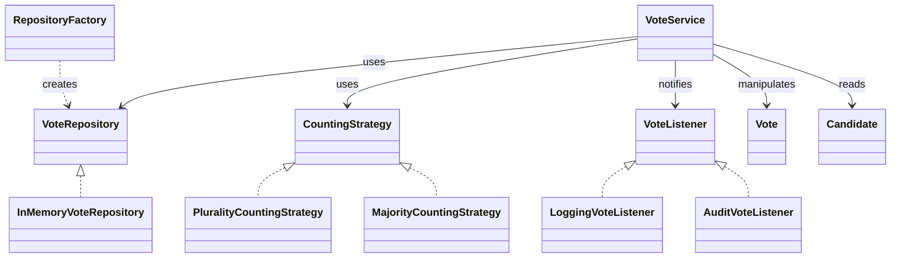

# Voting CI Demo (Refactoring + DevOps Pipeline)

Projet pédagogique : refactoring d'un "spaghetti code" en architecture claire + **3 design patterns** (Factory Method, Strategy, Observer) + **tests** + **CI/CD Jenkins** + **qualité SonarQube**.

## Prérequis
- Java 17
- Maven 3.8+
- (Optionnel) Docker Desktop (pour SonarQube en local)
- Jenkins (local ou serveur)

## Lancer le projet en local
### 1) Build + tests + couverture
```bash
mvn -ntp clean verify
```
- Rapport JaCoCo HTML : `target/site/jacoco/index.html`
- Rapport JaCoCo XML : `target/site/jacoco/jacoco.xml`

### 2) Exécuter l'application CLI
```bash
mvn -ntp exec:java
```

### 3) Générer le JAR exécutable
```bash
mvn -ntp clean package
java -jar target/voting-ci-demo-1.0-SNAPSHOT.jar
```

## Analyse SonarQube
### Option A (local) : SonarQube via Docker
```bash
docker run -d --name sonar -p 9000:9000 sonarqube:lts-community
```
Puis :
1. Ouvrir SonarQube : http://localhost:9000
2. Créer un projet `voting-ci-demo`
3. Générer un token
4. Lancer l'analyse :
```bash
mvn -ntp clean verify sonar:sonar \
  -Dsonar.host.url=http://localhost:9000 \
  -Dsonar.login=<SONAR_TOKEN>
```

### Option B (Jenkins) : pipeline automatique
Le **Jenkinsfile** fourni exécute :
1. Build + tests (`mvn clean verify`)
2. Sonar (`mvn sonar:sonar`)
3. Quality Gate (bloque si KO)
4. Package (jar) + archivage

#### À configurer dans Jenkins (une fois)
1. **Plugin SonarQube Scanner for Jenkins** + **Quality Gates**
2. *Manage Jenkins → System → SonarQube servers* : ajouter un serveur nommé **`SonarQube`**
3. *Manage Jenkins → Credentials* : ajouter un secret text :
   - **ID** : `SONAR_TOKEN`
   - **Secret** : le token Sonar
4. Créer un job **Pipeline** et pointer sur ce repo (SCM Git)

> Si tu utilises Windows agents, le Jenkinsfile bascule automatiquement entre `sh` et `bat`.

## Design Patterns implémentés
### Factory Method
`RepositoryFactory` : création de `VoteRepository` sans couplage.

### Strategy
`CountingStrategy` + `PluralityCountingStrategy` + `MajorityCountingStrategy` : changement d'algorithme de dépouillement.

### Observer
`VoteListener` + `LoggingVoteListener` + `AuditVoteListener` : notifications automatiques à chaque vote.

## UML (simplifié)


## Commandes utiles
```bash
# Tests ciblés
mvn -ntp test -Dtest="VoteServiceTest"

# Couverture
mvn -ntp clean test jacoco:report

# JavaDoc
mvn -ntp javadoc:javadoc
```

## Checklist "fin de projet"
- [x] Refactoring + patterns
- [x] Tests + JaCoCo (HTML + XML)
- [x] SonarQube (pom + sonar-project.properties)
- [x] Jenkinsfile (build/test/sonar/quality gate/package)
- [x] README + UML mermaid

---

### Notes pédagogiques
Ce projet met l'accent sur : séparation des responsabilités, testabilité, extensibilité (OCP), et qualité (coverage + quality gate).
